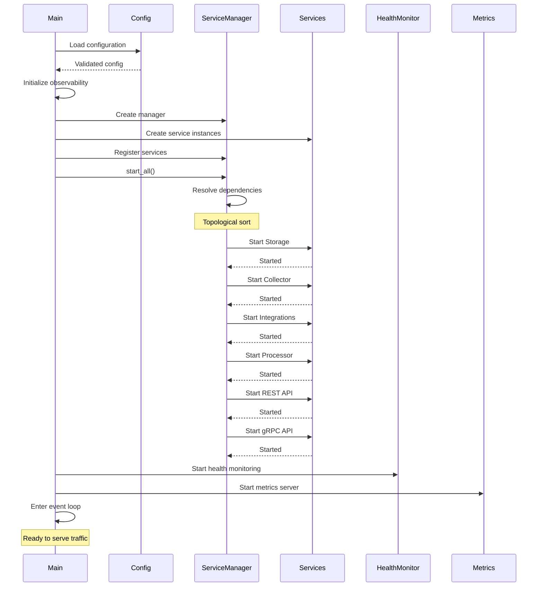
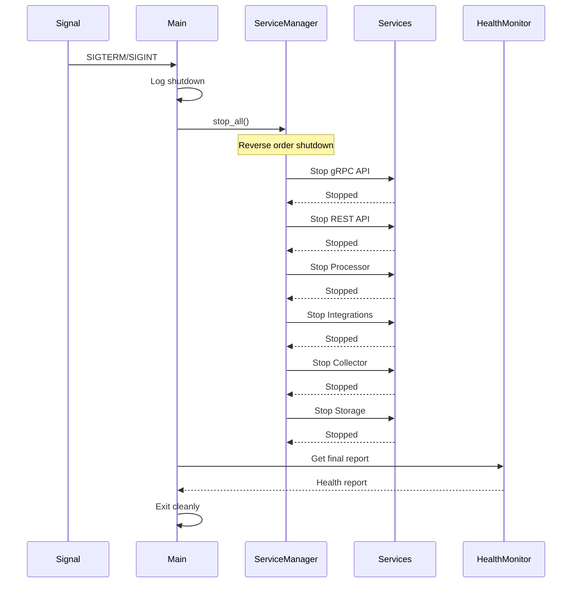
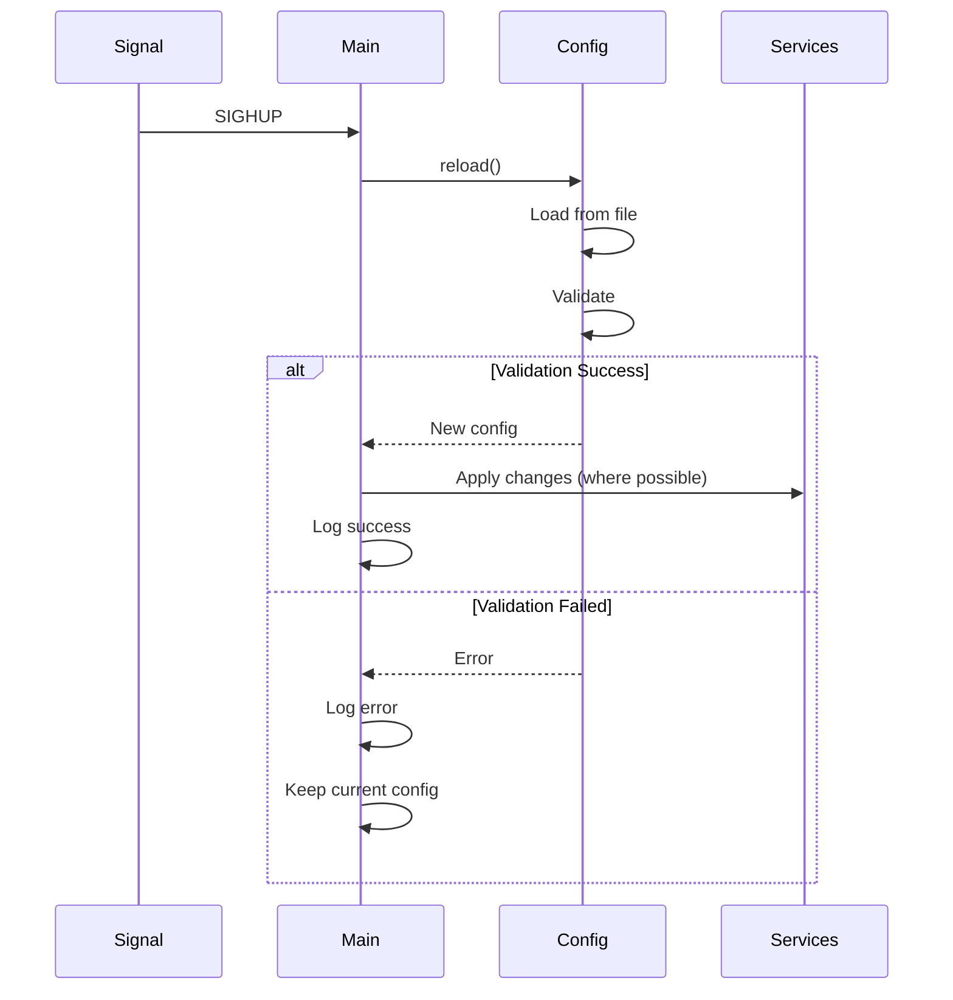
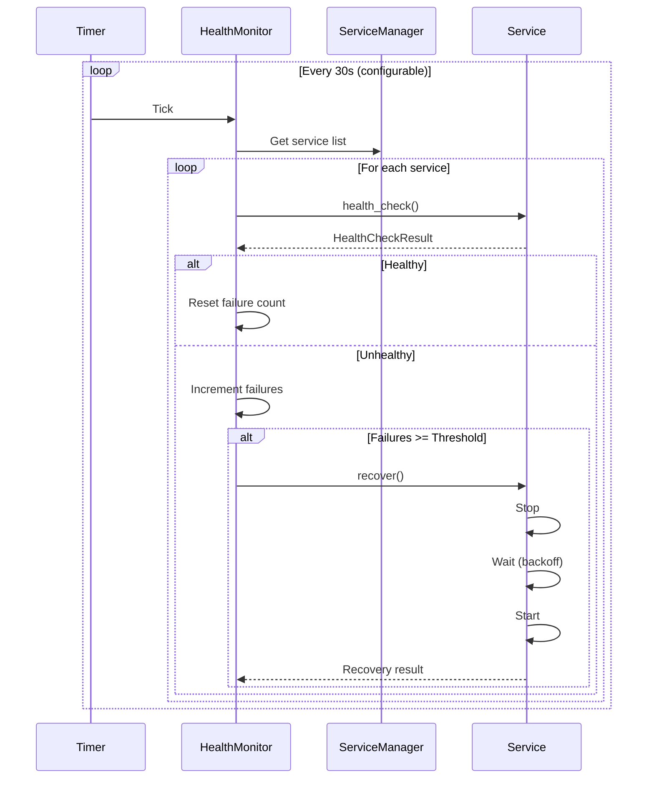

# LLM Auto Optimizer - Architecture Documentation

## System Overview

The LLM Auto Optimizer is a production-ready service orchestrator that manages multiple components in a single executable binary. It provides enterprise-grade features including automatic dependency resolution, health monitoring, graceful shutdown, and metrics export.

## Architecture Diagram

```
┌─────────────────────────────────────────────────────────────────────────────┐
│                         LLM Auto Optimizer Binary                            │
│                                                                               │
│  ┌─────────────────────────────────────────────────────────────────────┐   │
│  │                        Main Entry Point (main.rs)                    │   │
│  │  - Command-line argument parsing                                     │   │
│  │  - Configuration loading and validation                              │   │
│  │  - Observability initialization                                      │   │
│  │  - Main event loop (signal handling)                                 │   │
│  └────────────────────────────┬──────────────────────────────────────────┘   │
│                                │                                              │
│  ┌────────────────────────────▼────────────────────────────┐                │
│  │              Service Manager & Orchestrator              │                │
│  │                                                           │                │
│  │  Features:                                               │                │
│  │  ✓ Dependency resolution (topological sort)             │                │
│  │  ✓ Lifecycle management (start/stop/restart)            │                │
│  │  ✓ Health monitoring with auto-recovery                 │                │
│  │  ✓ Exponential backoff for retries                      │                │
│  │  ✓ Graceful shutdown coordination                       │                │
│  └─────────────────┬────────────────────────────────────────┘                │
│                    │                                                          │
│  ┌─────────────────┴────────────────────────────────────────┐               │
│  │                  Managed Services                         │               │
│  │                                                            │               │
│  │  ┌──────────────────────────────────────────────────┐   │               │
│  │  │ 1. Storage Service (No Dependencies)             │   │               │
│  │  │    - PostgreSQL (relational data)                │   │               │
│  │  │    - Redis (caching, pub/sub)                    │   │               │
│  │  │    - Sled (embedded key-value)                   │   │               │
│  │  └──────────────────────────────────────────────────┘   │               │
│  │                                                           │               │
│  │  ┌──────────────────────────────────────────────────┐   │               │
│  │  │ 2. Collector Service (No Dependencies)           │   │               │
│  │  │    - OpenTelemetry collection                    │   │               │
│  │  │    - Kafka event streaming                       │   │               │
│  │  │    - Circuit breaker pattern                     │   │               │
│  │  │    - Rate limiting                                │   │               │
│  │  │    - Backpressure handling                       │   │               │
│  │  │    - Dead letter queue                           │   │               │
│  │  └──────────────────────────────────────────────────┘   │               │
│  │                                                           │               │
│  │  ┌──────────────────────────────────────────────────┐   │               │
│  │  │ 3. Integrations Service (No Dependencies)        │   │               │
│  │  │    - Jira API client                             │   │               │
│  │  │    - Anthropic Claude API                        │   │               │
│  │  │    - Slack webhooks                              │   │               │
│  │  │    - GitHub API                                  │   │               │
│  │  └──────────────────────────────────────────────────┘   │               │
│  │                                                           │               │
│  │  ┌──────────────────────────────────────────────────┐   │               │
│  │  │ 4. Processor Service                             │   │               │
│  │  │    Dependencies: [collector, storage]            │   │               │
│  │  │                                                   │   │               │
│  │  │    - Stream processing pipeline                  │   │               │
│  │  │    - Window aggregation (tumbling, sliding)      │   │               │
│  │  │    - Event deduplication                         │   │               │
│  │  │    - Watermark management                        │   │               │
│  │  │    - Time series normalization                   │   │               │
│  │  │                                                   │   │               │
│  │  │    Sub-components:                               │   │               │
│  │  │    ├─ Analyzers (5 types)                       │   │               │
│  │  │    │  ├─ Performance Analyzer                   │   │               │
│  │  │    │  ├─ Cost Analyzer                          │   │               │
│  │  │    │  ├─ Quality Analyzer                       │   │               │
│  │  │    │  ├─ Pattern Analyzer                       │   │               │
│  │  │    │  └─ Anomaly Analyzer                       │   │               │
│  │  │    │                                             │   │               │
│  │  │    ├─ Decision Engine (5 strategies)            │   │               │
│  │  │    │  ├─ Model Selection                        │   │               │
│  │  │    │  ├─ Caching                                │   │               │
│  │  │    │  ├─ Rate Limiting                          │   │               │
│  │  │    │  ├─ Batching                               │   │               │
│  │  │    │  └─ Prompt Optimization                    │   │               │
│  │  │    │                                             │   │               │
│  │  │    └─ Actuators                                 │   │               │
│  │  │       ├─ Canary Deployment                      │   │               │
│  │  │       ├─ Configuration Manager                  │   │               │
│  │  │       ├─ Health Monitor                         │   │               │
│  │  │       └─ Rollback Engine                        │   │               │
│  │  └──────────────────────────────────────────────────┘   │               │
│  │                                                           │               │
│  │  ┌──────────────────────────────────────────────────┐   │               │
│  │  │ 5. REST API Service                              │   │               │
│  │  │    Dependencies: [processor, storage]            │   │               │
│  │  │                                                   │   │               │
│  │  │    - Axum web framework (HTTP/1.1, HTTP/2)      │   │               │
│  │  │    - Port: 8080 (configurable)                   │   │               │
│  │  │    - OpenAPI/Swagger documentation               │   │               │
│  │  │    - JWT & API key authentication                │   │               │
│  │  │    - RBAC authorization                          │   │               │
│  │  │    - Rate limiting                               │   │               │
│  │  │    - Request timeout                             │   │               │
│  │  │    - CORS support                                │   │               │
│  │  │    - Compression (gzip, brotli)                  │   │               │
│  │  │                                                   │   │               │
│  │  │    Endpoints:                                    │   │               │
│  │  │    - /health (health checks)                     │   │               │
│  │  │    - /metrics (internal metrics)                 │   │               │
│  │  │    - /optimize (optimization operations)         │   │               │
│  │  │    - /config (configuration management)          │   │               │
│  │  │    - /integrations (external services)           │   │               │
│  │  │    - /admin (administrative operations)          │   │               │
│  │  └──────────────────────────────────────────────────┘   │               │
│  │                                                           │               │
│  │  ┌──────────────────────────────────────────────────┐   │               │
│  │  │ 6. gRPC API Service                              │   │               │
│  │  │    Dependencies: [processor, storage]            │   │               │
│  │  │                                                   │   │               │
│  │  │    - Tonic framework (HTTP/2)                    │   │               │
│  │  │    - Port: 50051 (configurable)                  │   │               │
│  │  │    - TLS 1.3 support                             │   │               │
│  │  │    - Streaming (unary, server, client, bidi)     │   │               │
│  │  │    - Interceptors (auth, logging, metrics)       │   │               │
│  │  │    - gRPC reflection                             │   │               │
│  │  │    - Health check protocol                       │   │               │
│  │  │                                                   │   │               │
│  │  │    Services:                                     │   │               │
│  │  │    - OptimizationService                         │   │               │
│  │  │    - ConfigService                               │   │               │
│  │  │    - MetricsService (streaming)                  │   │               │
│  │  │    - IntegrationService                          │   │               │
│  │  │    - HealthService                               │   │               │
│  │  │    - AdminService                                │   │               │
│  │  └──────────────────────────────────────────────────┘   │               │
│  └───────────────────────────────────────────────────────────┘               │
│                                                                               │
│  ┌─────────────────────────────────────────────────────────────────────┐   │
│  │                        Supporting Components                         │   │
│  │                                                                       │   │
│  │  ┌────────────────────┐  ┌────────────────────┐  ┌───────────────┐ │   │
│  │  │  Health Monitor    │  │ Metrics Aggregator │  │ Signal Handler│ │   │
│  │  │                    │  │                    │  │               │ │   │
│  │  │  - Health checks   │  │  - Prometheus      │  │  - SIGTERM    │ │   │
│  │  │  - Auto-recovery   │  │    format export   │  │  - SIGINT     │ │   │
│  │  │  - Failure         │  │  - Service metrics │  │  - SIGHUP     │ │   │
│  │  │    tracking        │  │  - Request metrics │  │  - Graceful   │ │   │
│  │  │  - Recovery        │  │  - Resource usage  │  │    shutdown   │ │   │
│  │  │    backoff         │  │  - HTTP endpoint   │  │  - Config     │ │   │
│  │  │  - Uptime          │  │    (:9090/metrics) │  │    reload     │ │   │
│  │  └────────────────────┘  └────────────────────┘  └───────────────┘ │   │
│  └─────────────────────────────────────────────────────────────────────┘   │
│                                                                               │
└───────────────────────────────────────────────────────────────────────────────┘
```

## Startup Sequence



## Shutdown Sequence



## Configuration Reload



## Health Monitoring Flow



## Dependency Resolution

The Service Manager uses **Kahn's algorithm** for topological sorting to ensure services start in the correct order:

```
Input: Services with dependencies
Output: Ordered list of services to start

Algorithm:
1. Build adjacency list and in-degree count
2. Add all services with in-degree 0 to queue
3. While queue is not empty:
   a. Remove service from queue
   b. Add to result list
   c. For each dependent service:
      - Decrement in-degree
      - If in-degree becomes 0, add to queue
4. If result length != service count, there's a cycle
5. Return ordered list
```

Example dependency graph:

```
Storage (in-degree: 0)
    ↓
Collector (in-degree: 0)
    ↓
Integrations (in-degree: 0)
    ↓
Processor (in-degree: 2) ← depends on Storage, Collector
    ↓
REST API (in-degree: 2) ← depends on Processor, Storage
    ↓
gRPC API (in-degree: 2) ← depends on Processor, Storage
```

Startup order: Storage → Collector → Integrations → Processor → REST API → gRPC API

## Error Handling Strategy

### Service Failures

1. **Detection**: Health check fails
2. **Threshold**: Mark unhealthy after N consecutive failures (default: 3)
3. **Recovery**: Attempt restart with exponential backoff
4. **Backoff**: `min(base * 2^attempt, max_backoff)`
   - Base: 1 second
   - Max: 60 seconds
5. **Retry Limit**: Maximum 3 recovery attempts
6. **Final State**: If all retries fail, mark service as Failed

### Cascading Failure Prevention

- Services can run in degraded mode
- Dependent services continue if they can operate without failed service
- Circuit breaker pattern in Collector prevents overwhelming external services
- Backpressure handling prevents memory overflow

## Metrics Architecture

### Metric Types

1. **Gauges**: Current value (service status, health, connections)
2. **Counters**: Monotonically increasing (requests, errors)
3. **Histograms**: Distribution of values (request duration)

### Metric Labels

- `service`: Service name (storage, collector, processor, etc.)
- `operation`: Operation name (start, stop, health_check, etc.)
- `status`: Result status (success, error)

### Export Format

Prometheus text format on `/metrics` endpoint:

```
# HELP service_status Service status (1 = running, 0 = stopped)
# TYPE service_status gauge
service_status{service="storage"} 1
service_status{service="processor"} 1

# HELP request_duration_seconds Request duration histogram
# TYPE request_duration_seconds histogram
request_duration_seconds_bucket{operation="optimize",status="success",le="0.001"} 10
request_duration_seconds_bucket{operation="optimize",status="success",le="0.002"} 25
```

## State Management

### Service State Machine

```
Initializing → Running ⇄ Degraded
     ↓           ↓
   Failed ← ShuttingDown
     ↓           ↓
   Stopped ← Stopped
```

State transitions:
- `Initializing → Running`: Successful start
- `Running → Degraded`: Health check issues but still operational
- `Degraded → Running`: Recovery successful
- `Running/Degraded → ShuttingDown`: Shutdown initiated
- `ShuttingDown → Stopped`: Graceful shutdown complete
- `Running/Degraded → Failed`: Fatal error
- `Failed → Initializing`: Recovery attempt

### Shared State

Thread-safe shared state using:
- `Arc<RwLock<T>>`: Shared ownership with interior mutability
- `dashmap::DashMap`: Concurrent hash map
- `tokio::sync::broadcast`: Multi-producer multi-consumer channels

## Concurrency Model

### Tokio Runtime

- **Multi-threaded runtime**: Configurable worker threads
- **Work-stealing scheduler**: Efficient task distribution
- **Async I/O**: Non-blocking network operations

### Task Spawning

```rust
// Background health monitoring
tokio::spawn(async move {
    service_manager.run_health_monitoring().await
});

// Metrics server
tokio::spawn(async move {
    metrics.serve(addr).await
});

// Signal handling
tokio::spawn(async move {
    signal_handler.listen().await
});
```

### Synchronization

- **Channels**: For message passing between components
- **RwLock**: For shared configuration and state
- **Mutex**: For exclusive access to resources
- **Broadcast**: For shutdown signals

## Performance Considerations

### Memory Management

- **Bounded buffers**: Prevent unbounded memory growth
- **Connection pooling**: Reuse database connections
- **Event batching**: Reduce per-event overhead
- **Compression**: Reduce network bandwidth

### CPU Optimization

- **Parallel processing**: Multiple worker threads
- **Efficient serialization**: Binary formats (MessagePack, Bincode)
- **Compiled regex**: Pre-compile patterns
- **LTO and optimization**: Release builds with link-time optimization

### Latency Optimization

- **Connection reuse**: HTTP/2 multiplexing
- **Caching**: Redis for frequently accessed data
- **Batch operations**: Reduce round trips
- **Streaming**: Process data incrementally

## Security

### Authentication

- **JWT tokens**: Stateless authentication
- **API keys**: Simple key-based auth
- **TLS 1.3**: Encrypted communication

### Authorization

- **RBAC**: Role-based access control
- **Permission checks**: Fine-grained access control
- **Audit logging**: Track all operations

### Input Validation

- **Schema validation**: JSON schema validation
- **Type safety**: Rust's type system
- **Sanitization**: Prevent injection attacks

## Observability

### Logging

- **Structured logging**: Machine-parseable logs
- **Log levels**: trace, debug, info, warn, error
- **Context**: Request IDs for tracing
- **Format**: JSON for production, pretty for development

### Tracing

- **OpenTelemetry**: Distributed tracing
- **Span context**: Propagate across services
- **Baggage**: Metadata propagation

### Metrics

- **Prometheus**: Industry-standard metrics
- **Grafana**: Visualization dashboards
- **Alerts**: Based on metric thresholds

## Testing Strategy

### Unit Tests

- Test individual components in isolation
- Mock external dependencies
- Fast execution

### Integration Tests

- Test service interactions
- Use test containers for databases
- Realistic scenarios

### End-to-End Tests

- Full system deployment
- Real external services (in test environment)
- Performance testing

## Future Enhancements

1. **Dynamic service registration**: Add/remove services at runtime
2. **Service discovery**: Consul/etcd integration
3. **Load balancing**: Distribute work across instances
4. **Blue-green deployments**: Zero-downtime updates
5. **A/B testing**: Traffic splitting for experiments
6. **Auto-scaling**: Scale based on metrics
7. **Multi-region**: Geographic distribution
8. **Disaster recovery**: Automated failover

## Conclusion

The LLM Auto Optimizer provides a robust, scalable, and maintainable architecture for managing complex LLM optimization workflows. The service-oriented design with automatic dependency management, health monitoring, and graceful failure handling ensures high availability and reliability in production environments.
